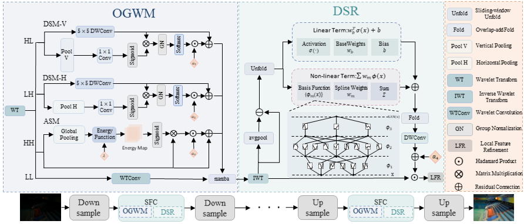

# SFC-Net
# SFC-Net: Spatial-Frequency Collaborative Network with Kolmogorov-Arnold Splines for Low-Light Image Enhancement

> **Abstract:** *Low-light image enhancement aims to restore visibility while preserving high-fidelity textures. Although recent wavelet-based frameworks effectively decouple illumination and details, applying uniform isotropic convolutions across high-frequency subbands ignores unique physical directionality and distinct noise distributions, inevitably causing structural aliasing and noise amplification. Moreover, static convolutions lack the nonlinear capacity to recover highly spatially-variant residuals in extremely dark regions. To address these limitations, we propose the Spatial-Frequency Collaborative Network (SFC-Net). In the frequency domain, the Oriented-Gradient Wavelet Module (OGWM) achieves physically interpretable decoupling via anisotropic pooling to preserve directional structural priors while adaptively suppressing noise. In the spatial domain, we introduce the Dynamic Spline Refinement (DSR) module based on Kolmogorov-Arnold Networks (KAN). By employing dynamic spline basis functions, DSR provides powerful spatially-variant nonlinear mapping to precisely reconstruct microscopic phase residuals and boundary artifacts. Extensive experiments on diverse benchmarks demonstrate that SFC-Net yields highly competitive performance and significantly benefits downstream object detection tasks in low-light environments.* 
>

  

---

## Installation

     python=3.9
     pytorch-lightning==2.4.0
     pytorch-ssim==0.1
     torchvision==0.16.1
     scipy==1.10.1 
     opencv-python==4.10.0.84

## Pretrained models

We provide the Google Drive links for the following pre-trained weights.

## Testing

You can run the following code for testing：

    python test.py

## Training

You can train your own model by running the following commad. 

    python train.py
    
## Results

  

  

  

